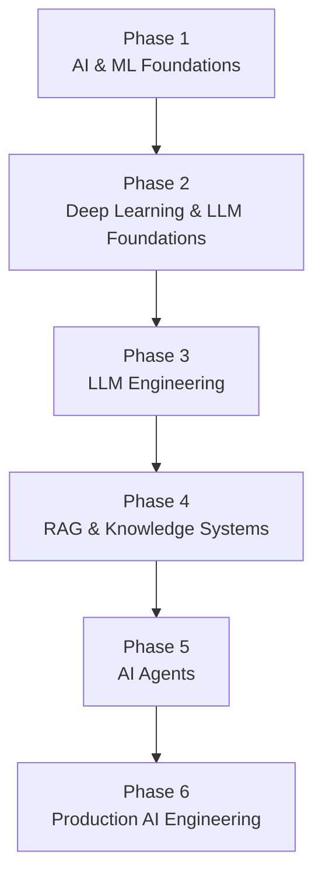

# 30-Day AI Engineer Learning Path

> A structured roadmap from AI/ML fundamentals to building production-ready AI systems.

This roadmap is divided into **6 phases**, with **5 lessons per phase**. Each phase builds on the previous one and gradually moves from foundational concepts to real-world AI engineering.

---

## Phase 1 — AI & ML Foundations

The first phase establishes the core knowledge required to understand how AI systems are built.

1. **AI Engineering Fundamentals**
2. **Python for AI Engineering**
3. **Machine Learning Fundamentals**
4. **Data Preparation & Feature Engineering**
5. **Model Training & Evaluation**

---

## Phase 2 — Deep Learning & LLM Foundations

This phase introduces the concepts behind modern deep learning and Large Language Models.

1. **Neural Networks Fundamentals**
2. **Deep Learning & Training**
3. **What Is an LLM?**
4. **Tokens & Tokenization**
5. **Transformers & Attention**

---

## Phase 3 — LLM Engineering

This phase focuses on building applications using modern Large Language Models.

1. **Embeddings & Vector Representations**
2. **LLM APIs & Inference**
3. **Prompt Engineering**
4. **Structured Outputs & Schema Validation**
5. **Function Calling & Tool Use**

---

## Phase 4 — RAG & Knowledge Systems

This phase covers how AI applications can retrieve and use external knowledge.

1. **Vector Databases & Similarity Search**
2. **RAG Fundamentals**
3. **Document Ingestion & Chunking**
4. **Advanced RAG & Retrieval**
5. **RAG Evaluation & Hallucination Reduction**

---

## Phase 5 — AI Agents

This phase introduces agentic systems that can reason, use tools, maintain state, and execute multi-step workflows.

1. **AI Agents Fundamentals**
2. **Agent Architecture & Loops**
3. **Agent Memory & State**
4. **Multi-Agent Systems**
5. **Human-in-the-Loop AI**

---

## Phase 6 — Production AI Engineering

The final phase focuses on taking AI systems from prototypes to reliable production systems.

1. **AI Evaluation & Testing**
2. **AI Security & Guardrails**
3. **AI Observability, Performance & Cost**
4. **Production AI System Design**
5. **End-to-End Production AI Project**

---

# Learning Progression



## The Goal

```text
Understand AI
      ↓
Understand ML
      ↓
Understand Deep Learning
      ↓
Understand LLMs
      ↓
Build LLM Applications
      ↓
Build RAG Systems
      ↓
Build AI Agents
      ↓
Evaluate & Secure AI
      ↓
Optimize AI Systems
      ↓
Design Production AI
```

> **The documentation for each lesson will explain the concepts in depth, with practical examples, architecture diagrams, code, trade-offs, and real-world use cases.**
