# AI Engineering Fundamentals

> **Day 01 — Foundations of AI Engineering**
>
> This lesson is intentionally about the **big picture**. Before learning Python, machine learning, LLMs, RAG, agents, or production AI, you first need to understand what an AI Engineer actually does and how AI fits into software engineering.

---

## 1. What Is AI Engineering?

Let's start with the simplest definition:

> **AI Engineering is the practice of building software products and systems that use AI capabilities to solve real-world problems.**

That sounds simple, but there is an important distinction.

Using an AI model is not the same thing as engineering an AI system.

For example:

```text
User
  ↓
"Summarize this document"
  ↓
AI Model
  ↓
Summary
```

You have successfully used AI.

But you haven't necessarily built an AI product.

A real application might look like:

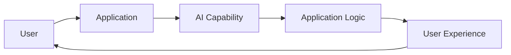

The AI Engineer works across that entire flow.

---

# 2. Why Do We Need AI Engineers?

Traditional software engineering generally works like this:

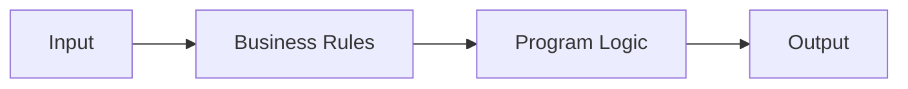

The developer explicitly defines the rules.

For example:

```text
If cart value > ₹5,000
then apply free shipping.
```

AI introduces another way of building software.

Instead of defining every possible rule manually, we can use a model that has learned patterns from data.

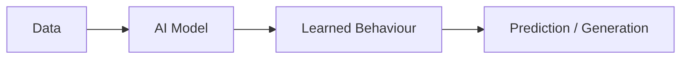

Now the engineer has a different problem.

The system's behavior depends partly on the model.

So we need engineers who understand both worlds:

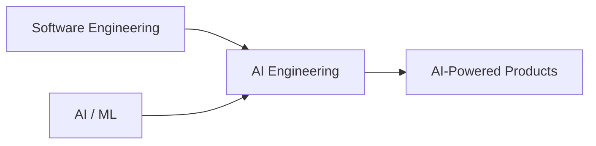

That intersection is where AI Engineering lives.

---

# 3. The Most Important Mental Model

If you are completely new to AI Engineering, remember this:

```text
Model ≠ Application ≠ Product
```

A model provides a capability.

An application uses that capability.

A product turns that capability into something useful for users.

Think about it like this:

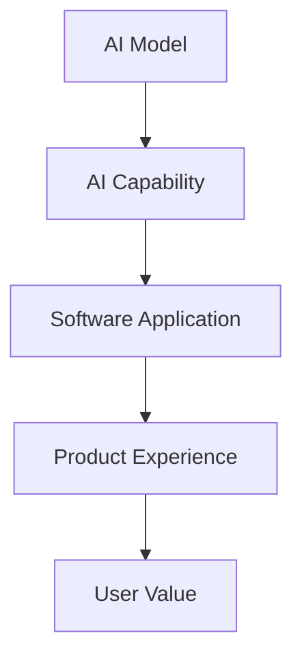

### Example

A language model can generate text.

That's the **model capability**.

You can build a chatbot around it.

That's the **application**.

You can build a customer-support platform where companies use that chatbot to resolve tickets.

That's the **product**.

The difference matters.

---

# 4. AI Model vs AI Application

Suppose you have this:

```python
response = model.generate("Explain this error")
```

This is useful, but it's only one operation.

A real application may need:

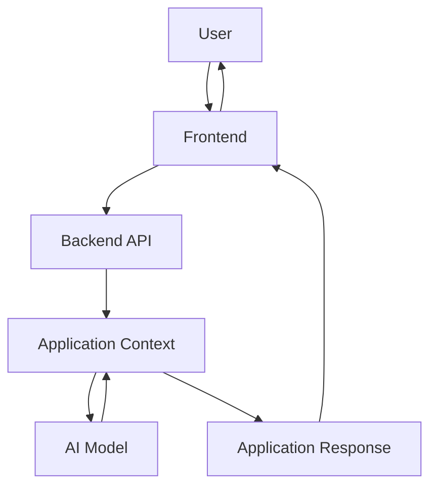

The model is only one component.

The application decides:

* What information to send
* When to call the model
* How to present the result
* How the result affects the workflow
* What the user is allowed to do

This is the first major shift in thinking:

> **AI Engineering is not just model usage. It is application engineering with AI as a core capability.**

---

# 5. AI Engineering vs AI Research

These two areas are closely related, but they have different goals.

## AI Research

A researcher may ask:

> "Can we make this model better?"

For example:

```text
New Architecture
      ↓
Training Method
      ↓
Experiment
      ↓
Better Model
```

The focus is on improving the underlying intelligence.

---

## AI Engineering

An AI Engineer may ask:

> "How can we use this capability to solve a customer's problem?"

For example:

```text
Existing Model
      ↓
Application
      ↓
Business Workflow
      ↓
Customer
```

So a simple distinction is:

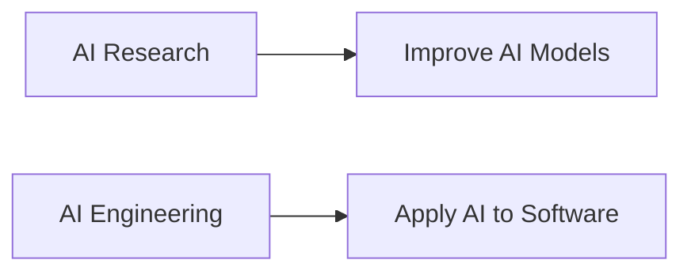

Neither is "better".

They solve different problems.

---

# 6. AI Engineer vs ML Engineer

The exact role depends on the company, so don't treat these definitions as strict boundaries.

A useful way to think about them is where their work is concentrated.

### ML Engineer

Often spends more time around:

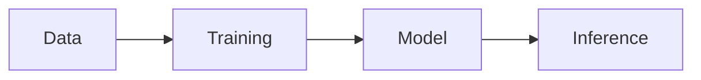

### AI Engineer

Often works further toward the application:

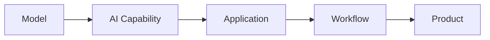

There is plenty of overlap.

An AI Engineer may also train models.

An ML Engineer may also build applications.

The distinction is mainly about **scope and focus**.

---

# 7. AI Engineering Is Bigger Than LLMs

Today, when people hear "AI Engineer", they often immediately think about LLMs.

LLMs are important.

But AI Engineering is broader.

It can involve:

```text
Machine Learning
Deep Learning
Computer Vision
Speech
Recommendation Systems
Generative AI
Language Models
Predictive Models
```

For example:

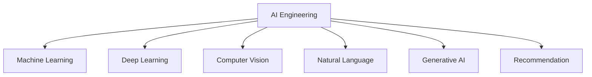

The common question is:

> **How do we use an AI capability inside a useful software system?**

---

# 8. Start With the Problem, Not the Model

This is one of the most important lessons in AI Engineering.

A beginner often starts with:

> "Which model should I use?"

A senior engineer starts with:

> "What problem are we solving?"

Consider this:

```text
"We should build an AI agent."
```

That isn't a requirement.

Instead:

```text
Customers currently spend
10 minutes finding answers
to common questions.
```

Now we have a problem.

Then:

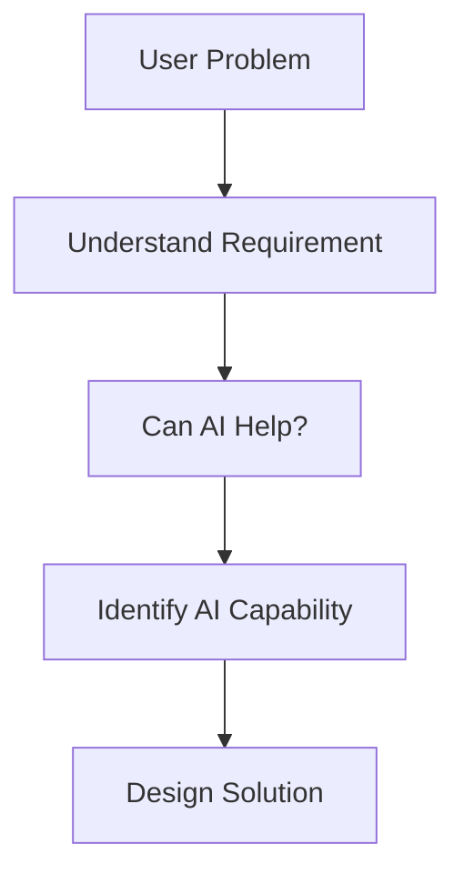

Only after understanding the problem should technology enter the conversation.

---

# 9. A Simple Real-World Example

Imagine a company has thousands of internal documents.

Employees frequently ask:

> "Where can I find the process for creating a purchase order?"

Today:

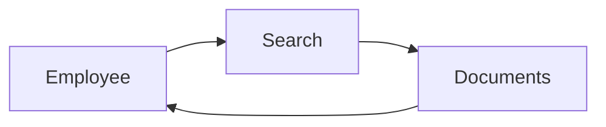

The problem is not:

> "We need an LLM."

The problem is:

> **Employees cannot find information quickly.**

AI may provide a better experience:

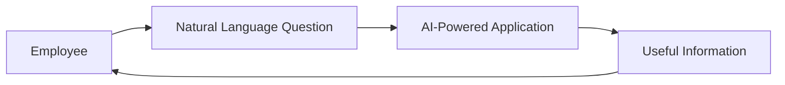

Notice the difference.

We started with a user problem.

AI became one possible solution.

---

# 10. AI Capability vs Product

Let's take another example.

Suppose an AI model can summarize documents.

The capability is:

```text
Document → Summary
```

But a product could be:

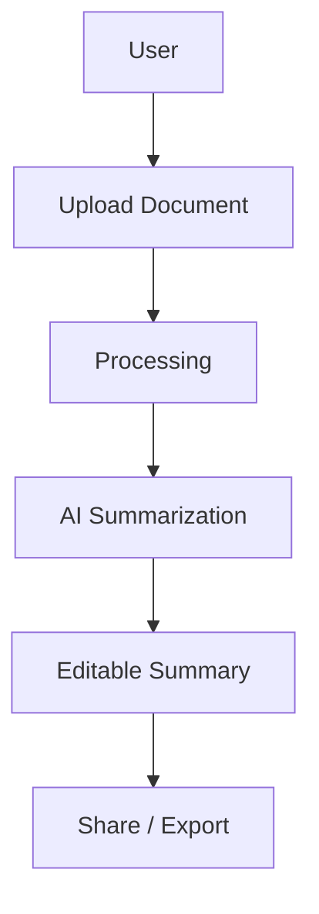

The model is only one part of the product.

The product also needs:

* User interface
* File handling
* Permissions
* Workflow
* Storage
* Error handling
* User experience

This is where engineering comes in.

---

# 11. The AI Engineering Lifecycle

A useful high-level lifecycle is:

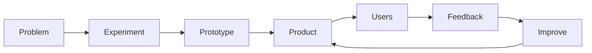

Let's understand each step.

### Problem

What are we trying to solve?

### Experiment

Can AI actually help?

### Prototype

Can we prove the idea quickly?

### Product

Can users actually use it?

### Users

What happens when real people use it?

### Feedback

What works and what doesn't?

### Improve

How do we make the product better?

This cycle is much more realistic than:

```text
Build Model → Done
```

AI products evolve continuously.

---

# 12. Prototype vs Production

This is another important distinction.

A prototype might look like:

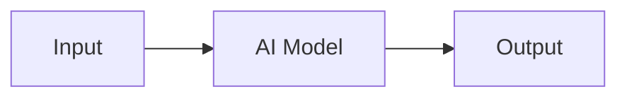

It answers:

> "Can this work?"

A product is different:

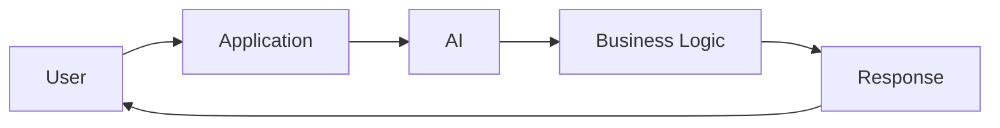

It answers:

> "Can users actually use this?"

Eventually, a production system becomes much larger.

But for Day 1, don't worry about the individual production technologies yet.

The important idea is simply:

> **A successful prototype and a successful product are different things.**

---

# 13. Where AI Fits Inside Software

If you've worked with software development before, you can think of AI as another capability inside the application.

Traditional application:

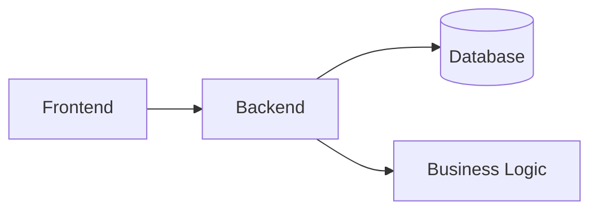

AI-powered application:

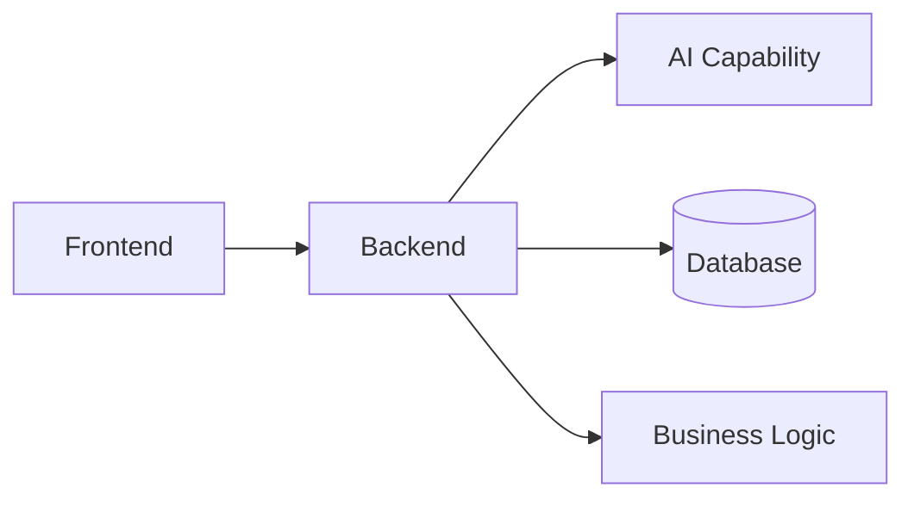

AI doesn't replace the rest of the application.

It becomes another component.

This is a very useful mental model for software engineers entering AI.

---

# 14. AI Engineering Requires Software Engineering

If you already know software engineering, you are **not starting from zero**.

You already understand concepts such as:

```text
APIs
Databases
HTTP
Authentication
Testing
Git
Deployment
Networking
Application Architecture
```

Those concepts remain relevant.

AI is added to the system.

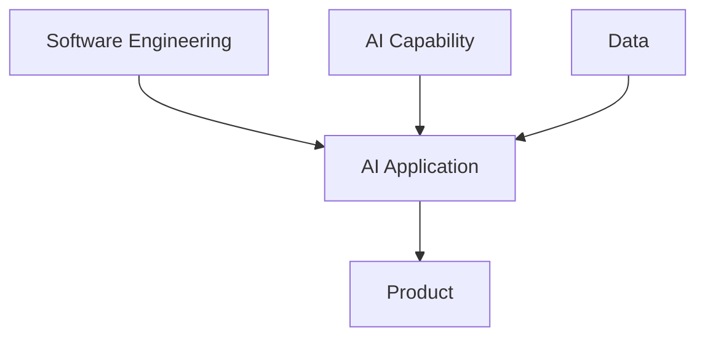

This is why experienced software engineers can transition into AI Engineering effectively.

You don't throw away your existing engineering knowledge.

You build on top of it.

---

# 15. The AI Engineer Sits Between Multiple Worlds

A good AI Engineer can understand multiple perspectives.

```mermaid
flowchart TD
    P[Product Problem] --> E[AI Engineer]
    ML[AI / ML] --> E
    SE[Software Engineering] --> E
    SYS[System Design] --> E
    DATA[Data] --> E
    
    E --> SOL[AI-Powered Solution]
```

You don't have to be the world's best researcher, data scientist, backend engineer, or product manager.

But you need enough understanding to connect these areas.

That ability to connect disciplines is extremely valuable.

---

# 16. AI Engineering Is About Trade-offs

There is rarely a single perfect solution.

Suppose you have two possible approaches:

```text
Approach A
Higher capability
Higher cost
Higher latency

Approach B
Good enough capability
Lower cost
Lower latency
```

Which one should you choose?

There is no universal answer.

It depends on the product.

The right question is:

> **What does the application actually need?**

Think about the trade-off:

```mermaid
flowchart LR
    Q[Quality] --- L[Latency]
    L --- C[Cost]
    C --- X[Complexity]
    X --- U[User Experience]
```

AI Engineering is full of these decisions.

---

# 17. Don't Automatically Choose the Most Powerful Model

A common beginner assumption is:

> "The biggest model must be the best choice."

Not necessarily.

Suppose your task is simple classification.

You may not need a large generative model.

```mermaid
flowchart TD
    P[Problem] --> C{Complexity}
    C -->|Simple| S[Simple AI Approach]
    C -->|Complex| L[More Capable AI Approach]
```

The best solution is the one that satisfies the requirements.

Not necessarily the one with the most capabilities.

---

# 18. Build vs Buy vs Integrate

When building an AI product, you will eventually face a decision:

> Should we build the capability ourselves?

There are usually several possibilities:

```mermaid
flowchart TD
    P[AI Requirement] --> D{Existing Capability?}
    
    D -->|Yes| E[Use / Integrate]
    D -->|Partially| A[Adapt Existing Model]
    D -->|No| B[Build / Train]
```

For many applications, using an existing model may be perfectly reasonable.

For some problems, custom development may make sense.

The decision depends on:

* Product requirements
* Data
* Cost
* Control
* Performance
* Time
* Business constraints

We will learn the technical details behind these choices later.

---

# 19. AI Is Not Always the Answer

This is an important senior-engineering principle.

Don't add AI just because AI is popular.

Imagine you need to determine whether:

```text
Order amount > ₹5,000
```

You probably don't need an LLM.

A simple rule is better:

```text
if amount > 5000:
    apply_discount()
```

AI should be introduced when it provides a meaningful advantage.

Think:

```mermaid
flowchart TD
    P[Problem] --> Q{Can normal software solve it?}
    Q -->|Yes| S[Use Simple Solution]
    Q -->|No| A{Can AI Add Value?}
    A -->|Yes| AI[Use AI]
    A -->|No| O[Explore Other Approaches]
```

This is what good engineering looks like.

---

# 20. AI Changes the Nature of Software

Traditional software often looks like:

```text
Input
  ↓
Rules
  ↓
Output
```

AI software can look like:

```mermaid
flowchart LR
    I[Input] --> C[Context]
    C --> M[AI Model]
    M --> O[Generated / Predicted Output]
```

The important difference is that the AI component may not behave like a traditional deterministic function.

That means the engineer needs a different mental model.

You cannot always assume:

```text
Same Input → Exactly Same Output
```

And you cannot assume:

```text
Model Output = Correct
```

That does **not** mean AI systems are unreliable by definition.

It means their behavior needs to be understood and handled appropriately.

The detailed techniques for doing this will come later.

---

# 21. AI Engineering Is Systems Thinking

Don't think:

```text
"I am building a model."
```

Think:

```mermaid
flowchart TD
    U[User] --> P[Product]
    P --> A[AI Application]
    A --> M[Model]
    A --> D[Data]
    A --> S[Supporting Services]
    
    M --> A
    D --> A
    S --> A
    
    A --> R[User Value]
```

The model is one component in a larger system.

A change to the model can affect the application.

A change to the application can affect the user experience.

A change in the product requirement can affect the entire architecture.

This is why system-level thinking matters.

---

# 22. Start With User Value

A technically impressive AI feature is not necessarily a good product.

Consider:

```text
Model Quality: Excellent
Technical Complexity: High
User Value: Low
```

That's not a successful product.

Instead:

```mermaid
flowchart LR
    A[User Problem] --> B[Useful AI Capability]
    B --> C[Good Product Experience]
    C --> D[Measurable User Value]
```

The goal is not:

> "Build something with AI."

The goal is:

> **"Use AI where it creates meaningful value."**

---

# 23. The AI Engineer's First Questions

When you receive a new AI requirement, start with these questions:

### Problem

**What exactly are we trying to solve?**

### User

**Who experiences this problem?**

### Current Solution

**How is it solved today?**

### Value

**What improvement are we trying to create?**

### AI Opportunity

**Where could AI provide leverage?**

### Constraints

**What constraints do we have?**

### Simplicity

**What is the simplest solution that can work?**

Put together:

```mermaid
flowchart TD
    A[Problem] --> B[User]
    B --> C[Current Workflow]
    C --> D[Desired Outcome]
    D --> E[AI Opportunity]
    E --> F[Solution]
```

This is a much stronger starting point than selecting a model first.

---

# 24. What Does an AI Engineer Actually Build?

There isn't one single type of AI product.

An AI Engineer could work on:

```mermaid
flowchart TD
    A[AI Engineering]
    
    A --> B[AI Assistants]
    A --> C[AI Search]
    A --> D[Recommendations]
    A --> E[Document Intelligence]
    A --> F[Automation]
    A --> G[Developer Tools]
    A --> H[Prediction Systems]
```

For example:

### AI Assistant

```text
User → Assistant → Answer / Action
```

### AI Search

```text
Question → AI Search → Relevant Information
```

### Recommendation

```text
User Behaviour → Model → Recommendations
```

### Document Intelligence

```text
Document → AI → Structured Information
```

The technology differs.

The engineering mindset remains the same.

---

# 25. The AI Engineering Learning Map

You don't need to learn everything at once.

The journey should look something like:

```mermaid
flowchart LR
    A[Fundamentals] --> B[Python]
    B --> C[Machine Learning]
    C --> D[Deep Learning]
    D --> E[LLMs]
    E --> F[LLM Applications]
    F --> G[RAG]
    G --> H[Agents]
    H --> I[Production AI]
```

Each topic builds on the previous one.

That is why this fundamentals lesson comes first.

---

# 26. What We Are NOT Learning Today

This is important.

Day 1 is **not** supposed to teach everything about AI.

We are deliberately not going deep into:

* Python
* Machine learning algorithms
* Feature engineering
* Model training
* Neural networks
* Deep learning
* LLM architecture
* Tokens
* Transformers
* Embeddings
* RAG
* Vector databases
* Agents
* Evaluation
* Security
* Observability
* Production system design

Those topics have dedicated lessons.

Today's goal is simpler:

> **Understand the field before learning the tools.**

---

# 27. What You Should Know After Day 1

By the end of this lesson, you should be able to explain:

### What is AI Engineering?

> Building software systems and products that use AI capabilities to solve real-world problems.

### Is AI Engineering just LLM development?

No.

LLMs are one part of the broader AI Engineering landscape.

### Does an AI Engineer need to train models?

Not necessarily.

An AI Engineer can build products using existing models and services.

### Is AI Engineering just machine learning?

No.

It combines AI/ML knowledge with software engineering, systems thinking, and product thinking.

### Should you start by choosing a model?

No.

Start with the problem and determine whether AI is actually useful.

### Is a model a product?

No.

A model provides a capability. A product turns that capability into user value.

---

# 28. A Beginner's Mental Model

If you are starting from zero, remember this simple chain:

```mermaid
flowchart LR
    A[Real Problem] --> B[Can AI Help?]
    B --> C[AI Capability]
    C --> D[Software]
    D --> E[Product]
    E --> F[User Value]
```

For example:

```text
Problem:
People spend too much time searching documents.

        ↓

AI Opportunity:
Understand natural-language questions.

        ↓

AI Capability:
Find / generate useful information.

        ↓

Software:
Build an application around it.

        ↓

Product:
Help employees find information faster.

        ↓

Value:
Save time.
```

That is AI Engineering in its simplest form.

---

# 29. Senior Engineer Perspective

As you progress, your questions should evolve.

### Beginner

> "How do I call an AI model?"

### Intermediate

> "How do I build an application around the model?"

### Advanced

> "How do I make the AI application reliable and useful?"

### Senior

> "Is AI the right solution, what architecture fits the problem, and what trade-offs are we making?"

That progression is important.

The goal of this course isn't just to teach you APIs.

It is to teach you **how to think about AI systems as an engineer**.

---

# 30. The Core Principle

If you remember one principle from this entire lesson:

```text
Don't start with the model.

Start with the problem.
```

Then:

```mermaid
flowchart TD
    A[Problem] --> B[Understand User]
    B --> C[Define Success]
    C --> D[Identify AI Opportunity]
    D --> E[Choose Approach]
    E --> F[Build Product]
```

And always ask:

> **Does this actually create value?**

---

# 31. Final Mental Model

Everything we will learn over the next 30 days eventually connects back to this:

```mermaid
flowchart TB
    P[Real-World Problem]

    P --> U[User & Product Requirements]

    U --> AI[AI Capability]

    AI --> APP[Software Application]

    APP --> SYS[Complete AI System]

    SYS --> VALUE[User & Business Value]
```

The model is important.

But it is not the whole story.

---

# 32. Day 01 Summary

AI Engineering is the intersection of:

```text
AI / ML
    +
Software Engineering
    +
Systems Thinking
    +
Product Thinking
```

The core workflow is:

```text
Problem
  ↓
Understand the User
  ↓
Identify the AI Opportunity
  ↓
Choose the Right Approach
  ↓
Build the Application
  ↓
Create User Value
```

And the most important distinction is:

```text
Model
  ↓
Capability
  ↓
Application
  ↓
Product
  ↓
Value
```

---

# Key Takeaways

1. **AI Engineering is about applying AI to real software problems.**
2. **A model is not the same thing as an application or product.**
3. **AI Engineering is broader than LLMs.**
4. **AI Engineers don't necessarily train models from scratch.**
5. **Software engineering remains a core AI Engineering skill.**
6. **Start with the problem, not the model.**
7. **AI should be used where it provides meaningful value.**
8. **The simplest solution is often the best starting point.**
9. **AI Engineering requires thinking across AI, software, systems, and product.**
10. **The goal is not AI for its own sake — the goal is useful software.**

---

# One Last Thing

You don't need to understand everything about AI after this lesson.

You should simply have a clear map in your head:

```text
                    AI ENGINEERING
                           │
          ┌────────────────┼────────────────┐
          ↓                ↓                ↓
        AI/ML          SOFTWARE           PRODUCT
          │                │                │
          └────────────────┼────────────────┘
                           ↓
                    AI APPLICATIONS
                           ↓
                     REAL VALUE
```

**This is your starting point.**

The next lessons will take each part of the map and teach it properly, one step at a time.

---

# Day 01 → Day 02

```mermaid
flowchart LR
    A["Day 01<br/>AI Engineering Fundamentals"] --> B["Day 02<br/>Python for AI Engineering"]
```

**Day 1:** Understand the field.

**Day 2:** Start building the technical foundation.
